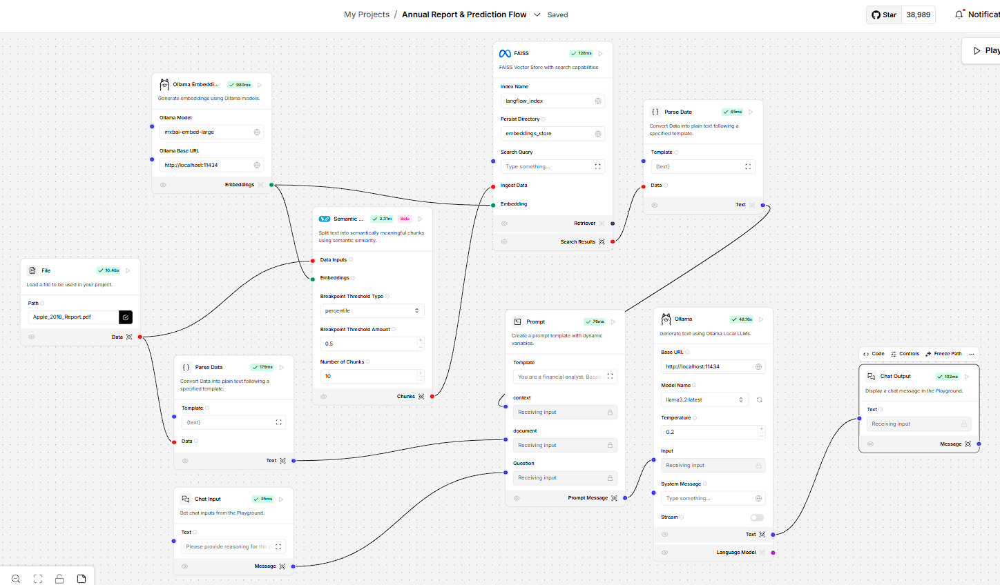
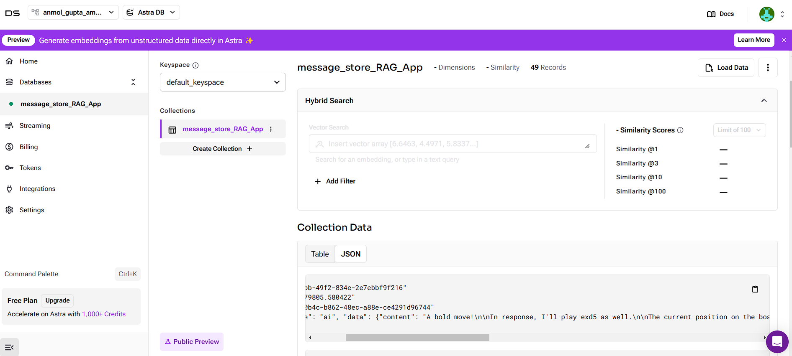
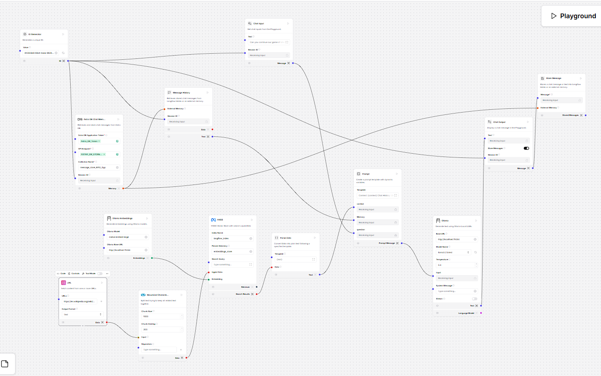

# LangFlow-Practice
Practicing building applications using LangFlow [LangFlow] [GenAI] [RAG] [Ollama]

## Understanding the Ability of LLMs to do a comparison across documents

OpenAI's GPT-4: Selected GPT-4 as the language model to analyze and summarize key sections of Walmart's annual reports. I configured it for consistent responses by setting the temperature to 0.

Extracting Data from Annual Reports: Processed the 2018 and 2023 annual reports using an automated tool (PyMuPDFLoader) to focus on two critical sections:
 - Risk Factors
 - Management Discussion and Analysis (MD&A).

## Exploring if LLMs are capable of reasoning and prediction

A Langflow flow was created where the Annual Report was uploaded to the flow, converted to similar/meaningful chunks (Using Similarity Search) which was then embedded with the Ollama Embeddings and using the FAISS Vector Store was fed to the prompt along with a System Prompt. 
This was then fed to an Ollama Local LLM. The screenshot for the flow is given below –

 - The overall observation for the behaviour of LLMs is that even though they are able to retrieve the revenue numbers and predict subsequent years’ revenue, they are not very reliable and accurate.
 - Since the LLMs only work on similarity scores and do not understand context provided in the other sections of the report, they are not reliable enough for financial predictions
 - Hence, context needs to be built and understood by the LLM to provide more accurate predictions which it is unable to do so, as of today.
 - In addition, when asked to provide reasoning about the predictions, the LLMs used to predict a different value than given by it previously without any improvement in the accuracy of the predicted value.

## Modifying normal LLMs and providing the ability to store chat memory

 - For the ability to store chat memory, the Astra DB Chat Memory component was used to create an Astra DB Vector database to store users’ chats which can be accessed later (based on the unique Session ID passed for every chat)
 - For the ability to have conversations with different users, the ID Generator component was used to create a unique Session ID for each user chat. This enables users to create a new chat and go back to it whenever they like, based on the Session ID

The screenshot for the AstraDB Dashboard is given below - 

The screenshot for the flow is given below –
